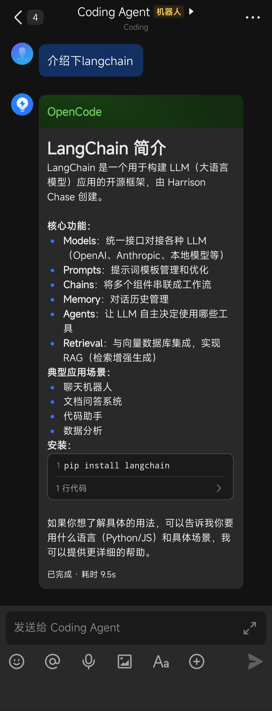

# OpenCode ↔ Feishu Bridge

> 🚀 Bring OpenCode's powerful AI capabilities directly to your team via Feishu/Lark

English | [中文](./README.md)

<p align="center">
  
</p>

---

## 💡 Why Do You Need This Bridge?

Have you ever faced these pain points?

- **Constant window switching** — Copy-pasting AI responses between terminal and Feishu
- **Lost context** — Re-explaining background every time, AI can't remember previous conversations
- **Inefficient team collaboration** — Good AI responses need manual forwarding to colleagues
- **Batch processing waiting** — Staring at a spinning terminal, not knowing if AI is thinking or stuck

**OpenCode Feishu Bridge** solves these problems directly — Ask in Feishu, get AI answers instantly, share with your team.

---

## ✨ Key Features

### 🌊 True Streaming Output with Typewriter Effect

Not simple "request-wait-return", but **real-time streaming** — AI thinks and speaks simultaneously, you see text appearing character by character on the Feishu card, just like a real person typing.

```
Traditional:  [Send] → Waiting... → Waiting... → Return complete response at once
Bridge:       [Send] → Thinking... → Start answering → Text streams in real-time → Done
```

### 📊 Feishu Card Streaming Updates

Implemented following Feishu's official OpenClaw plugin, using **CardKit Streaming API**:

- Real-time updates on the same card, no multiple messages
- Typewriter effect + loading animation for smooth experience
- Auto-switch to completion state with elapsed time

### 🔒 Isolated Session Management

Each Feishu group/private chat **maintains independent conversation context**:

- Group A asks about Project A, Group B asks about Project B — no interference
- AI remembers conversation context for natural follow-up questions
- Supports multiple simultaneous sessions with automatic message queuing

### 📝 Markdown Rendering Optimization

Deep optimization for Feishu card Markdown rendering:

- Auto-add spacing for code blocks to avoid sticking
- Auto-adapt heading levels to Feishu card's maximum supported level
- Auto-merge consecutive blank lines for clean layout

### 📋 Complete Logging

Dual log system with automatic daily rotation:

- `logs/chat_YYYYMMDD.log` — Complete conversation records (user queries + AI responses + tool calls)
- `logs/error_YYYYMMDD.log` — Error logs for easy troubleshooting

---

## 🏗️ Architecture

```
┌─────────────┐     WebSocket      ┌──────────────────┐
│  Feishu Client│ ◄──────────────► │   feishu_bridge   │
│ (Mobile/Desktop)                  │  (Msg Listener)   │
└─────────────┘                    └────────┬─────────┘
                                            │
                                     Message Queue
                                            │
                                            ▼
                                   ┌──────────────────┐
                                   │  opencode_bridge  │
                                   │  (Core Bridge)    │
                                   └────────┬─────────┘
                                            │
                                   SSE Stream
                                            │
                                            ▼
                                   ┌──────────────────┐
                                   │  opencode serve   │
                                   │   (AI Engine)     │
                                   └──────────────────┘
```

**Data Flow:**
1. User sends message in Feishu → Feishu WebSocket pushes to bridge
2. Bridge queues message, worker thread retrieves and forwards to OpenCode
3. OpenCode returns AI thinking process and response via SSE stream
4. Bridge parses stream in real-time, updates Feishu card via CardKit API

---

## 🚀 Quick Start

### Requirements

- **Python**: 3.8+
- **OpenCode**: Installed and working (run `opencode --version` to confirm)
- **Feishu App**: Created Feishu custom app with App ID and App Secret

### Installation

```bash
# Clone repository
git clone https://github.com/Sun3299/feishu_opencode.git
cd feishu_opencode
```

### Configuration

Copy the config template and edit:

```bash
cp config.json.example config.json
```

Edit `config.json`:

```json
{
    "feishu": {
        "app_id": "cli_xxxxxxxxxxxx",
        "app_secret": "xxxxxxxxxxxxxxxxxxxxxxxx",
        "default_chat_id": "oc_xxxxxxxxxxxxxxxxxxxxxxxx"
    },
    "opencode": {
        "path": "opencode",
        "host": "127.0.0.1",
        "port": 0,
        "timeout": 30
    },
    "logs": {
        "dir": "logs"
    }
}
```

**Configuration Reference:**

| Field | Description |
|-------|-------------|
| `feishu.app_id` | Feishu App ID |
| `feishu.app_secret` | Feishu App Secret |
| `feishu.default_chat_id` | Default message receiver group ID (for startup notification) |
| `opencode.path` | OpenCode executable path |
| `opencode.port` | Service port (0 = auto-assign) |

### Feishu App Setup

1. Login to [Feishu Open Platform](https://open.feishu.cn/)
2. Create enterprise custom app
3. Add **Bot** capability
4. Add permissions:
   - `im:message` — Get and send private/group messages
   - `im:message:send_as_bot` — Send messages as app identity
5. Event subscription: Add `im.message.receive_v1`
6. Publish app and get `App ID` and `App Secret`

### Start

**Windows:**
```bash
start.bat
```

**Universal:**
```bash
python feishu_bridge.py
```

After startup, the bridge will:
1. Start OpenCode service
2. Connect Feishu WebSocket
3. Send ready notification to default group

---

## 📖 Usage

### Feishu Conversation

Directly **@bot** in Feishu group or send private message, AI will auto-respond.

### Terminal Interactive Mode

```bash
python opencode_bridge.py -i
```

Supported commands:
- `/new` — Create new session
- `/sessions` — List all sessions
- `/quit` — Exit

### Single Query

```bash
python opencode_bridge.py "Explain this project's architecture"
```

### Specify Model and Directory

```bash
python opencode_bridge.py -m claude-sonnet-4-20250514 -d /path/to/project "Help me refactor this code"
```

---

## 🎨 Demo

```
┌─────────────────────────────────────────┐
│  🤖 OpenCode                            │
├─────────────────────────────────────────┤
│                                         │
│  About this Python project's arch,      │
│  let me analyze:                        │
│                                         │
│  ## Core Components                     │
│                                         │
│  1. **feishu_bridge.py** — Feishu Msg   │
│  2. **opencode_bridge.py** — AI Bridge  │
│                                         │
│  ```python                             │
│  # Main class                          │
│  class OpenCodeBridge:                 │
│      def send(self, message): ...      │
│  ```                                   │
│                                         │
├─────────────────────────────────────────┤
│  ✅ Completed · Elapsed 3.2s            │
└─────────────────────────────────────────┘
         ↑ Auto-switch to green theme on completion
```

---

## 🔧 Project Structure

```
feishu_opencode/
├── feishu_bridge.py      # Feishu bridge (WebSocket listener + message queue + API)
├── opencode_bridge.py    # OpenCode bridge (service startup + SSE parser + terminal render)
├── config.json           # Configuration file
├── start.bat             # Windows startup script
├── images/               # Screenshots
│   └── running_example.jpg
└── logs/                 # Log directory (auto-created)
    ├── chat_YYYYMMDD.log
    └── error_YYYYMMDD.log
```

---

## ⚠️ Security & Risk Warnings (Read Before Use)

This bridge connects to OpenCode AI automation capabilities and carries inherent risks:

- **Model Hallucinations** — AI may generate incorrect or misleading content
- **Unpredictable Execution** — AI execution results may exceed expectations
- **Prompt Injection** — Malicious input may induce AI to perform dangerous operations

After authorizing Feishu permissions, OpenCode will act under your user identity within the authorized scope, which may lead to:
- Sensitive data leakage
- Unauthorized operations
- Unexpected modifications

### Security Recommendations

1. **Strongly recommend NOT to modify any default security settings**
2. **Recommend using the bridge as a private conversation assistant** — do not add it to group chats or allow other users to interact with it
3. Follow least privilege principle for Feishu app permissions
4. Keep `app_secret` in `config.json` secure, do not commit to public repositories

> ⚠️ Once restrictions are relaxed, risks will significantly increase. You bear all consequences.

### Disclaimer

This software is licensed under MIT. Running it calls Feishu Open Platform APIs, which requires compliance with:

- [Feishu User Terms of Service](https://www.feishu.cn/en/terms)
- [Feishu Privacy Policy](https://www.feishu.cn/en/privacy)
- [Feishu Store App Service Provider Security Management Specifications](https://open.larkoffice.com/document/uAjLw4CM/uMzNwEjLzcDMx4yM3ATM/management-practice/app-service-provider-security-management-specifications)

By using this bridge, you are deemed to voluntarily assume all related responsibilities.

---

## 📄 License

MIT License

---

## 🙏 Acknowledgments

- [OpenCode](https://github.com/opencode-ai/opencode) — Powerful AI programming assistant
- [openclaw-lark](https://github.com/larksuite/openclaw-lark) — Feishu official OpenClaw plugin, streaming card implementation reference
- [Feishu Open Platform](https://open.feishu.cn/) — Comprehensive API and documentation

---

<p align="center">
  <b>If this project helps you, please give it a ⭐ Star!</b>
</p>
